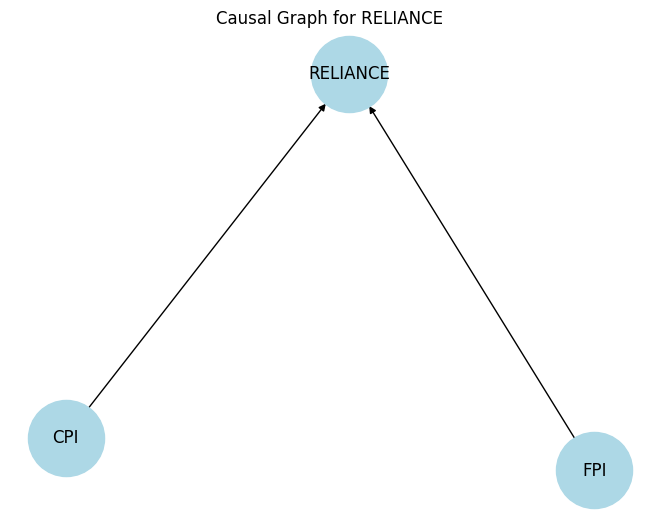

# 🚀 Predictive Modeling for Stock Price Prediction using Time Series & Causal Analysis

## 📌 Table of Contents

- [Introduction](#introduction)
- [Demo](#demo)
- [Inspiration](#inspiration)
- [What It Does](#what-it-does)
- [How We Built It](#how-we-built-it)
- [Model Details](...)
- [Challenges We Faced](#challenges-we-faced)
- [How to Run](#how-to-run)
- [Tech Stack](#tech-stack)
- [Team](#team)

---

## 🎯 Introduction

Stock price prediction is challenging due to market volatility, high-dimensional data, and the influence of external
factors such as economic indicators, interest rates, and news sentiment. Traditional time series models capture
historical trends but often fail to explain causal relationships. This research integrates Time Series Analysis with
Causal Analysis to improve prediction accuracy and interpretability by identifying key drivers of stock prices beyond
historical patterns. The approach aims to enhance financial decision-making in trading, portfolio management and risk
assessment.

## 🎥 Demo

🔗 [Live Demo](#) (if applicable)  
📹 [Video Demo](#) (if applicable)  


## 💡 Inspiration

The stock market is volatile with factors that can affect its performance, making it difficult to predict. Whereas, as
institutions employ sophisticated analytics, retail investors work with little raw data. Most existing models either
capture trends over time or the causal influences without consistent profitability.

This project integrates time-series analysis with causal inference in order to improve prediction accuracy by modeling
cause-and-effect relationships in stock price movements. The machine learning approach provides a new avenue to address
challenges such as noise and non-stationarity given the advancement of machine learning and increasing access to vast
amount of financial data, eventually making it a highly relevant and relatable problem for the team.

## ⚙️ What It Does

Objective of this project is to build a predictive model for stock prices by combining time series forecasting and
causal analysis to understand key factors influencing stock market trends. The expected outcomes of this project:

- A predictive model for stock price forecasting using time series.
- A graph-based model incorporating cross-sectoral dependencies for enhanced prediction.
- A comprehensive report detailing model performance and key causal factors identified.

### Use cases:

- Cross-sectoral analysis of stock dependencies for portfolio optimization.
- Enhanced prediction of price movements with causal relationships.
- Advanced risk assessment for institutional and retail investors.

### HLD & Workflow


## 🛠️ How We Built It


## Model Details

## Background

Traditional models like LSTMs often fail in stock market prediction due to their
inability to capture long-term dependencies, noisy data, and the non-stationary
nature of financial time series. This emphasizes the need for advanced architectures like GNNs and
Transformers that can better handle complex dependencies and causal relationships.

## Model Details

### LSTM - Long Short Term Memory

<details>
   <summary>🔍 Click to see details.</summary>

LSTMs, are a specialized type of RNN architecture designed to tackle a specific challenge—remembering information over
extended periods. These models that enhance the memory capabilities of recurrent neural networks. These networks
typically hold short-term memory, utilizing earlier information for immediate tasks within the current neural network.

LSTMs can analyze historical price data and past events to potentially predict future trends, considering long-term
factors that might influence the price.
Even though LSTMs offer advantages for predicting stock market prices, there are still challenges to consider:

**Data Quality and Noise**: A multitude of factors influences stock prices, many of which remain unpredictable, such as
news events and social media sentiment. LSTMs might struggle to differentiate between relevant patterns and random noise
in
the data, potentially leading to inaccurate predictions.

**Limited Historical Data**: The effectiveness of LSTMs depends on the quality and quantity of historical data
available.
For newer companies or less liquid stocks, there might not be enough data to train the model effectively, limiting its
ability to capture long-term trends.

**Non-Linear Relationships**: While LSTMs can handle complex relationships, the stock market can exhibit sudden shifts
and
non-linear behavior due to unforeseen events. The model might not be able to perfectly capture these unpredictable
fluctuations.

**Overfitting and Generalizability**: There’s a risk of the model overfitting the training data, performing well on
historical data but failing to generalize to unseen future patterns. Careful hyperparameter tuning and validation
techniques are crucial to ensure the model can learn generalizable insights.

**Self-Fulfilling Prophecies**: If a large number of investors rely on LSTM predictions, their collective actions could
influence the market in a way that aligns with the prediction, creating a self-fulfilling prophecy. This highlights the
importance of using these predictions as a potential guide, not a guaranteed outcome.

**Causal Factors**: LSTM cannot take advantage of causal analysis in predicting a stock price. Macro factors such as
USD-INR, RepoRate etc play significant role in causing stock price movements

#### LSTM Results

When trained with Indian stock price details along with its macro-factors in place with the data, the
LSTM struggled to incorporate the causal dependencies and non-linear dependencies.

**Model Details**

```plain
Model: "sequential"
┏━━━━━━━━━━━━━━━━━━━━━━━━━━━━━━━━━┳━━━━━━━━━━━━━━━━━━━━━━━━┳━━━━━━━━━━━━━━━┓
┃ Layer (type)                    ┃ Output Shape           ┃       Param # ┃
┡━━━━━━━━━━━━━━━━━━━━━━━━━━━━━━━━━╇━━━━━━━━━━━━━━━━━━━━━━━━╇━━━━━━━━━━━━━━━┩
│ lstm (LSTM)                     │ (None, 64)             │        18,688 │
├─────────────────────────────────┼────────────────────────┼───────────────┤
│ dense (Dense)                   │ (None, 1)              │            65 │
└─────────────────────────────────┴────────────────────────┴───────────────┘
 Total params: 56,261 (219.77 KB)
 Trainable params: 18,753 (73.25 KB)
 Non-trainable params: 0 (0.00 B)
 Optimizer params: 37,508 (146.52 KB)
```

**Model Metric**

```plain
R-squared (R2): 0.8507604692671287
```

**Conclusion**
Since R2 is not very great, also, the model loss during training is found to be too high.
Hence LSTM is not a good fit for stock target prediction.

</details>

### GNN - Graph Neural Network

<details>
   <summary>🔍 Click to see details.</summary>

GNNs use a neural network architecture to learn from the graph structure and the attributes associated with nodes and
edges.
They can then use this learned knowledge to make predictions or draw conclusions. Graph transformers represent a
significant
advancement in the realm of machine learning, particularly for graph-structured data. They combine the strengths of
traditional
Graph Neural Networks (GNNs) with the powerful attention mechanisms of transformers, leading to enhanced performance
across
various tasks.

#### Core Concepts of Graph Transformers

Graph transformers utilize a message-passing framework similar to GNNs but incorporate self-attention mechanisms to
weigh the
importance of different nodes during the aggregation process. This allows for a more nuanced understanding of the
relationships
within the graph. The architecture typically consists of:

* **Input Layer**: Where node features are fed into the model.
* **Attention Mechanism**: This layer computes attention scores to determine the significance of neighboring nodes.
* **Aggregation Layer**: Node features are updated based on the weighted contributions from their neighbors.
* **Output Layer**: Produces the final predictions or embeddings.

#### GNN Transformer Convolutions

Transformer convolutions combine the local feature extraction capabilities of Convolutional Neural Networks (CNNs) with
the
global context understanding of Transformers. This hybrid approach aims to enhance performance.

**Key Features**

* **Local and Global Feature Extraction**: By utilizing convolutions, the model can capture local patterns while the
  Transformer
  layers provide a broader context.
* **Dynamic Attention Mechanisms**: Transformers introduce attention mechanisms that allow the model to focus on
  relevant
  parts of the input, improving interpretability and performance.
* **Scalability**: The architecture can be scaled up or down depending on the task, making it versatile for different
  applications.

##### Implementation Details

Here are the step by step details how we arrived at model implementations

1. Took the time series data of Stocks and Macro factors
2. Cleansed the data, performed EDA
3. To get all data onto same time interval, forward filled data to make it align with daily data of stocks
4. Macro factors and other economic indicators are forward filled to daily data
5. Merged Stock data with the Macro factors data based on Date
6. Checked if the data is stationary using ADF-Test with respect to the target which is closing price of the stock
7. Differencing to detrend the time series and make it stationary
8. Checked if macro factors are stationary and made it stationary
9. Ran Granger Causal Analysis to fetch causal inference between the Stocks and Macro factors and cross-sectoral
   dependencies
10. Constructed graph with the causal factors with Stocks and Macro factors as the nodes with edges representing
    cause-effect relationship between them
11. Normalized the data for macro factors
12. Converted graph data into tensors
13. Constructed Graph Transformer Convolutions with input parameters with causal factors and economic factors.
14. Used Relu activation function to negate the gradient descent problem. Also used Adam optimizer to tune the model
    parameters
15. Used model in eval mode to forecast the stock value.

Here is the model summary of our Graph Convolution Transformer

```plain
+--------------------------+-----------------------+----------------+----------+
| Layer                    | Input Shape           | Output Shape   | #Param   |
|--------------------------+-----------------------+----------------+----------|
| GNNTransformer           | [24227, 8], [2, 337]  | [24227, 1]     | 1,284    |
| ├─(conv1)TransformerConv | [24227, 8], [2, 337]  | [24227, 32]    | 1,152    |
| ├─(conv2)TransformerConv | [24227, 32], [2, 337] | [24227, 1]     | 132      |
+--------------------------+-----------------------+----------------+----------+

```

Example Causal DAG for RELIANCE stock


</details>

### GCN - Graph Convolution Network

<details>
    <summary>🔍 Click to see details.</summary>
GCNConv is PyTorch Geometric's implementation of the Graph Convolutional Network (GCN) layer introduced by Kipf & Welling (2017). It is one of the most widely used and foundational GNN layers for learning on graph-structured data.

At its core, GCNConv performs message passing by aggregating feature information from a node’s neighbors using a
mean-based aggregation scheme with symmetric normalization of the adjacency matrix. The output is then passed through a
linear transformation to produce new node embeddings.

#### 🔄 GCNConv vs. TransformerConv – Key Differences

| Feature                  | GCNConv                                       | TransformerConv                                    |
|--------------------------|-----------------------------------------------|----------------------------------------------------|
| **Aggregation**          | Fixed mean (with adjacency normalization)     | Learnable attention-based (multi-head)             |
| **Attention**            | ❌ No                                          | ✅ Yes                                              |
| **Edge Features**        | ❌ Not supported                               | ✅ Supported (as attention bias)                    |
| **Positional Awareness** | ❌ No                                          | ✅ Can include via edge attributes                  |
| **Multi-head Support**   | ❌ No                                          | ✅ Yes                                              |
| **Computation Cost**     | Low                                           | High                                               |
| **Expressive Power**     | Moderate (limited depth & structure modeling) | High (global, contextual, and structure-aware)     |
| **Use Case**             | Simple, homophilic graphs                     | Complex or heterophilic graphs with rich structure |

#### GCN vs GNN Transformer Hyperparameter comparison

| Hyper Parameter               | GCN                      | GNN                        |
|-------------------------------|--------------------------|----------------------------|
| Number of layers              | 2                        | 2                          |
| Hidden layer size             | 16                       | 16                         |
| Learning rate                 | 0.01                     | 0.01                       |
| Dropout rate                  | 0.1                      | 0.1                        |
| Weight decay                  |                          |                            |
| Batch size                    |                          |                            |
| Number of training epochs     | 100                      | 100                        |
| Aggregation function          | Mean                     | Mean, Max, LSTM, Attention |
| Activation function           | ReLU                     | Relu                       |
| Optimizer                     | Adam                     | Adam                       |
| Normalization                 | Symmetric adjacency norm | BatchNorm                  |
| Attention heads               | N/A                      | 4–8                        |
| Neighborhood sampling size    | N/A                      |                            |
| Positional encoding dimension | N/A                      | 16                         |

The R2 metric and loss from GCN is found to be way higher than the TransformerConv model. Hence this is not chosen as
candidate option for modelling


</details>

## 🚧 Challenges We Faced

Describe the major technical or non-technical challenges your team encountered.

## 🏃 How to Run

1. Clone the repository
   ```sh
   https://github.com/vchandraiitk/iisc-capstone.git
   ```
2. Install dependencies
   ```sh
   pip install -r requirements.txt
   ```
3. Run the project
   ```sh
   python app.py
   ```

## 🏗️ Tech Stack

- 🔹 Frontend: Streamlit/Gradio
- 🔹 Backend: Python
- 🔹 Database: csv files
- 🔹 Other: Fill

## 👥 Team

- **Madhava Keshavamurthy
  ** - [GitHub](https://github.com/madhavamk) | [LinkedIn](https://www.linkedin.com/in/madhavamk/)
- **Vikas Chandra
  ** - [GitHub](https://github.com/vchandraiitk) | [LinkedIn](https://www.linkedin.com/in/vikas-chandra-3112496/)
- **Richa Parikh
  ** - [GitHub](https://github.com/richa1543) | [LinkedIn](https://www.linkedin.com/in/richa-parikh-824a1b124/)


